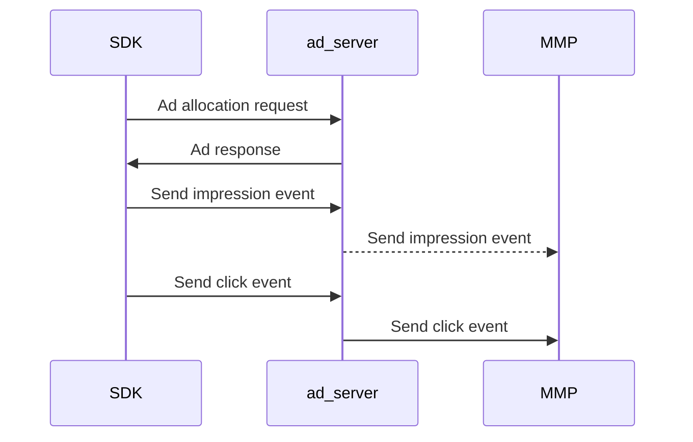
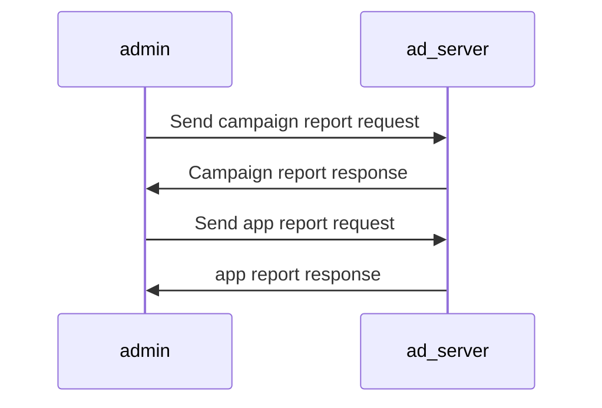

# playground

```mermaid
sequenceDiagram

SDK->>ad_server: Ad allocation request
ad_server->>SDK: Ad response
SDK->>ad_server: Send impression event
ad_server-->>MMP: Send impression event
SDK->>ad_server: Send click event
ad_server->>MMP: Send click event
```

```mermaid
sequenceDiagram

admin->>ad_server: Send campaign report request
ad_server->>admin: Campaign report response
admin->>ad_server: Send app report request
ad_server->>admin: app report response
```